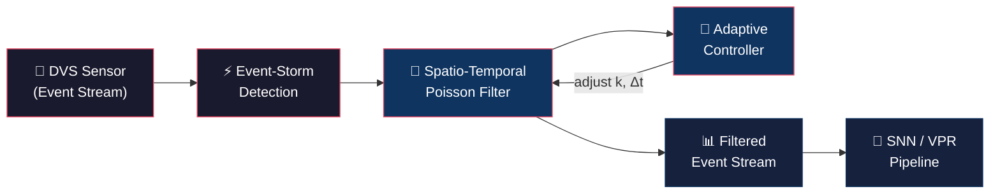

<p align="center">
  <h1 align="center">NET: Neuromorphic Event Triage</h1>
  <p align="center">
    <strong>Robust Visual Place Recognition in High-Entropy Environments</strong><br>
    <em>Optimizing Ultra-Low-Energy Localization via Spatio-Temporal Noise Filtering</em>
  </p>
  <p align="center">
    <a href="LICENSE"></a>
    
    
  </p>
</p>

---

## Abstract

Event cameras (Dynamic Vision Sensors) offer microsecond-level temporal resolution and ultra-low power consumption, making them ideal sensors for autonomous navigation. However, real-world DVS deployments suffer from **Event-Storm noise** — bursts of spurious events caused by lighting changes, sensor noise, and high-frequency environmental flickering — that overwhelm downstream Spiking Neural Networks (SNNs) and degrade Visual Place Recognition (VPR) accuracy.

**NET** introduces a **Spatio-Temporal Poisson Filter** with an **adaptive feedback controller** that dynamically triages event streams in real-time. By exploiting the statistical properties of structured visual events versus noise, NET maintains a stable, information-dense event rate for downstream SNN-based localization, reducing data throughput by up to 70% while preserving navigational signal integrity.

## Architecture



### How It Works

1. **Event-Storm Detection** — Monitor incoming event density in real-time chunks
2. **Spatio-Temporal Poisson Filter** — Retain an event only if ≥ `k` correlated neighbors exist within radius `r` pixels and time window `Δt` ms (Numba JIT-compiled for real-time throughput)
3. **Adaptive Controller** — Dynamically adjusts filter strictness (`k`) based on measured event density, maintaining stable output rate during noise bursts
4. **Benchmarking** — Compare against `tonic.transforms.Denoise` baseline using EPPS, SNR, and Recall@N metrics

## Installation

```bash
git clone https://github.com/YOUR_USERNAME/NET-VPR.git
cd NET-VPR
pip install -r requirements.txt
```

### Requirements

- Python ≥ 3.9
- NumPy, h5py, Matplotlib, SciPy, tqdm
- [Tonic](https://tonic.readthedocs.io/) — Event camera transforms & baseline denoising
- [Numba](https://numba.pydata.org/) — JIT compilation for filter acceleration

## Quick Start

```bash
# Generate a synthetic noisy DVS dataset and visualize the Event-Storm
python -m src.generator

# Run the full benchmark pipeline (after all phases are implemented)
python scripts/benchmark.py
```

## Project Structure

```
NET-VPR/
├── src/
│   ├── __init__.py        # Package metadata
│   ├── generator.py       # DVS event stream simulator (Phase 2)
│   ├── filter.py          # Numba-accelerated Poisson filter (Phase 3)
│   └── controller.py      # Adaptive feedback controller (Phase 4)
├── scripts/
│   └── benchmark.py       # End-to-end benchmarking (Phase 5)
├── data/
│   ├── raw/               # Generated HDF5 event streams
│   └── processed/         # Filtered output streams
├── results/               # Publication-quality figures
├── requirements.txt
├── LICENSE                 # Apache 2.0
└── README.md
```

## HDF5 Data Format

Event streams follow the **LENS / Event-LAB** compatible layout:

```
sample_events.hdf5
└── events/
    ├── x    (uint16)  — pixel x-coordinate
    ├── y    (uint16)  — pixel y-coordinate
    ├── t    (int64)   — timestamp in microseconds
    └── p    (uint8)   — polarity (0 = OFF, 1 = ON)
```

## Metrics

| Metric | Description |
|--------|-------------|
| **EPPS** | Events Per Pixel Per Second — measures event density |
| **SNR** | Signal-to-Noise Ratio — structured signal energy vs. noise floor |
| **Recall@N** | Theoretical place recognition accuracy at rank N |
| **Data Reduction** | Percentage of events removed by filtering |

## Citation

```bibtex
@software{setiawan2026net,
  title  = {NET: Neuromorphic Event Triage for Robust Visual Place Recognition},
  author = {Setiawan, Jonathan},
  year   = {2026},
  url    = {https://github.com/YOUR_USERNAME/NET-VPR}
}
```

## License

This project is licensed under the Apache License 2.0 — see the [LICENSE](LICENSE) file for details.