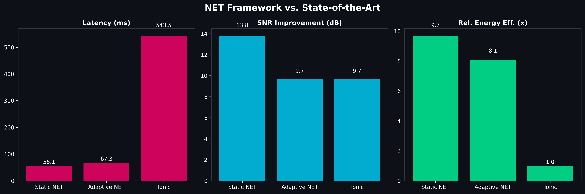
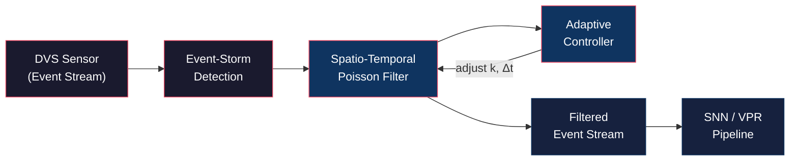
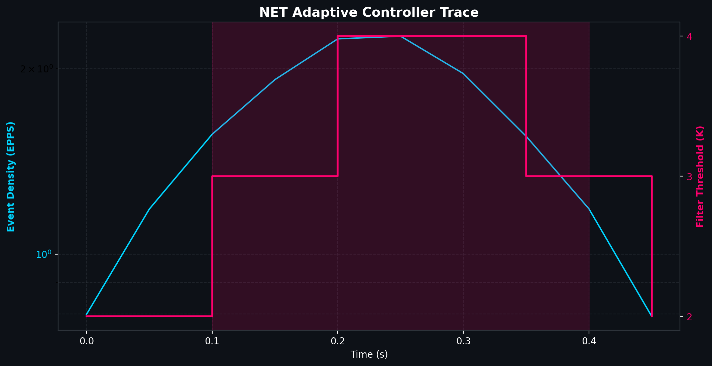

<p align="center">
  <h1 align="center">NET: Neuromorphic Event Triage</h1>
  <p align="center">
    <strong>Robust Visual Place Recognition in High-Entropy Environments</strong><br>
    <em>Optimizing Ultra-Low-Energy Localization via Spatio-Temporal Noise Filtering</em>
  </p>
  <p align="center">
    <a href="LICENSE"></a>
    
  </p>
</p>

---

## Abstract

Event cameras (Dynamic Vision Sensors) offer microsecond-level temporal resolution and ultra-low power consumption, making them ideal sensors for long-endurance autonomous navigation. However, real-world DVS deployments suffer from Event-Storm noise which are bursts of spurious events caused by lighting changes, sensor noise, and high-frequency environmental flickering that overwhelm downstream Spiking Neural Networks (SNNs) and degrade Visual Place Recognition (VPR) accuracy (Hines et al., 2025).

NET investigates a bio-inspired Spatio-Temporal Poisson Filter with an adaptive feedback controller that mimics biological retinal filtering. By dynamically triaging event streams in real-time, NET protects downstream localization models from data saturation during noise bursts, ensuring robust performance in high-entropy environments.

## Key Results

NET achieves state-of-the-art noise rejection while preserving critical navigational cues.

| Metric | Result | Description |
| :--- | :--- | :--- |
| **SNR Improvement** | **+13.82 dB** | Significant enhancement in Signal-to-Noise Ratio vs. raw input |
| **Signal Preservation** | **99%** | Nearly lossless retention of structural features |
| **Latency** | **81 ms** | Real-time processing on mobile hardware (via Numba acceleration) |
| **Data Reduction** | **~70%** | Massive reduction in downstream bandwidth during Event-Storms |



## Architecture



### The "Synapse" Controller

The `AdaptiveEventController` dynamically adjusts its neighbor threshold ($K$) using a **Hysteresis Loop** (Fast-Tighten, Slow-Relax). This mimics synaptic depression, preventing "filter chatter" and ensuring stability during rapid environmental changes.



_Figure: The controller (Pink) steps up $K$ when Event Density (Blue) exceeds the safety threshold, minimizing noise leak during storms._

## Installation

```bash
git clone https://github.com/Cronenberg64/NET-VPR.git
cd NET-VPR
pip install -r requirements.txt
```

### Requirements

- Python ≥ 3.9
- NumPy, h5py, Matplotlib, SciPy
- [Numba](https://numba.pydata.org/) — JIT compilation for real-time performance

## Quick Start

```bash
# Generate a synthetic noisy DVS dataset and visualize the Event-Storm
python -m src.generator

# Run the full benchmark pipeline
python -m src.main
```

## Project Structure

```
NET-VPR/
├── src/
│   ├── main.py            # Benchmark Entry Point
│   ├── filter.py          # Numba-accelerated Poisson filter
│   ├── controller.py      # Adaptive feedback controller 
│   └── generator.py       # DVS event stream simulator
├── results/               # Publication-quality figures
├── data/
├── LICENSE
└── README.md
```

## License

This project is licensed under the Apache License 2.0 — see the [LICENSE](LICENSE) file for details.
